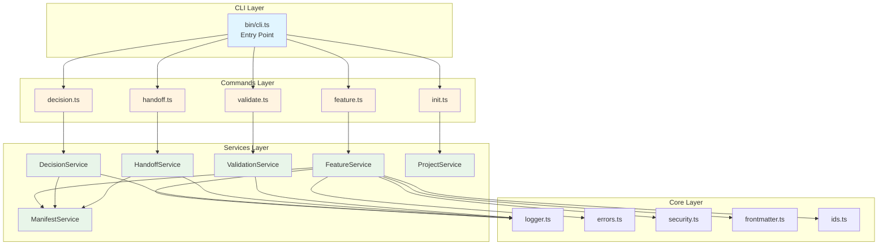

# Levit-Kit Architecture

This document describes the internal architecture of `levit-kit` following the V2 refactoring.

## Design Principles

1. **Separation of Concerns**: CLI layer separated from business logic
2. **Strong Typing**: All domain concepts explicitly typed
3. **Machine-Readable**: Structured errors and JSON output support
4. **Testability**: Pure services enable fast unit testing

## Directory Structure

```
src/
├── bin/
│   └── cli.ts              # CLI entry point
├── commands/               # CLI command handlers
│   ├── init.ts
│   ├── feature.ts
│   ├── decision.ts
│   ├── handoff.ts
│   └── validate.ts
├── services/               # Business logic layer
│   ├── feature_service.ts
│   ├── decision_service.ts
│   ├── handoff_service.ts
│   ├── validation_service.ts
│   ├── manifest_service.ts
│   └── project_service.ts
├── types/                  # Domain type definitions
│   ├── domain.ts
│   └── manifest.ts
└── core/                   # Shared utilities
    ├── logger.ts
    ├── errors.ts
    ├── security.ts         # Security utilities (path validation, safe file ops)
    ├── cli_args.ts
    ├── ids.ts
    ├── paths.ts
    └── write_file.ts

tests/
├── cli/                    # Integration tests
│   └── integration.test.ts
└── services/               # Unit tests
    ├── feature_service.test.ts
    ├── decision_service.test.ts
    ├── handoff_service.test.ts
    └── validation_service.test.ts
```

### Architecture Diagram



> **📐 For more detailed diagrams**, see [DIAGRAMS.md](../DIAGRAMS.md)

## Layers

### 1. CLI Layer (`bin/cli.ts`)
- Entry point for the `levit` command
- Handles global flags (`--json`, `--help`, `--version`)
- Routes commands to appropriate handlers
- Catches and formats errors using `Logger`

### 2. Commands Layer (`src/commands/`)
**Responsibility**: User interaction and I/O

- Parse command-specific arguments
- Handle interactive prompts (readline)
- Call Services to perform operations
- Display results using `Logger`
- Throw `LevitError` on failures

**Example**: `feature.ts`
```typescript
export async function featureCommand(argv: string[], cwd: string) {
  const projectRoot = requireLevitProjectRoot(cwd);
  const { title, slug, id } = parseArgs(argv);
  
  const createdPath = FeatureService.createFeature(projectRoot, { title, slug, id });
  Logger.info(`Created ${createdPath}`);
}
```

### 3. Services Layer (`src/services/`)
**Responsibility**: Business logic (pure functions)

- No I/O side effects (no console.log, no process.exit)
- Return data or throw `LevitError`
- Testable in isolation
- Reusable by other tools/agents

**Example**: `FeatureService`
```typescript
export class FeatureService {
  static createFeature(projectRoot: string, options: CreateFeatureOptions): string {
    // Generate file
    // Return relative path
    return path.relative(projectRoot, featurePath);
  }
}
```

### 4. Types Layer (`src/types/`)
**Responsibility**: Domain model definitions

- `domain.ts`: Core AIDD concepts (Feature, Decision, Handoff)
- `manifest.ts`: levit.json schema

### 5. Core Layer (`src/core/`)
**Responsibility**: Shared utilities

- `logger.ts`: Centralized logging with JSON mode
- `errors.ts`: Structured error types (`LevitError`, `LevitErrorCode`)
- `cli_args.ts`: Argument parsing helpers
- `ids.ts`: Sequential ID generation
- `paths.ts`: Path resolution
- `write_file.ts`: Safe file writing

## Key Concepts

### Machine-Readable Contract (`levit.json`)
Every project includes a `levit.json` manifest containing:
- Project metadata
- Governance settings (autonomy level, risk tolerance)
- Active features (synced from filesystem)
- Available roles (synced from filesystem)
- Technical constraints

This file is **THE** central contract for AI agents.

### Structured Errors
All errors use `LevitError` with typed error codes:
```typescript
throw new LevitError(
  LevitErrorCode.VALIDATION_FAILED,
  "Validation failed with 3 errors."
);
```

### JSON Mode
All commands support `--json` flag for machine-readable output:
```bash
levit feature new --title "My Feature" --slug "my-feature" --json
```

Output:
```json
{
  "level": "INFO",
  "message": "Created features/001-my-feature.md",
  "timestamp": "2026-01-01T12:00:00.000Z"
}
```

## Testing Strategy

### Integration Tests (`tests/cli/`)
- Test full CLI flow (spawn process)
- Verify end-to-end behavior
- Slower but realistic

### Unit Tests (`tests/services/`)
- Test Services in isolation
- Fast feedback loop
- Mock-free (use temp directories)

## Evolution Guidelines

When adding new features:

1. **Define types first** in `src/types/`
2. **Implement service** in `src/services/`
3. **Add command handler** in `src/commands/`
4. **Write unit tests** in `tests/services/`
5. **Add integration test** in `tests/cli/`
6. **Update manifest** if needed

Keep services pure, commands thin, and types explicit.
