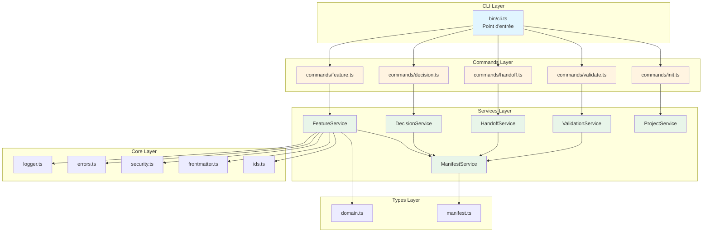
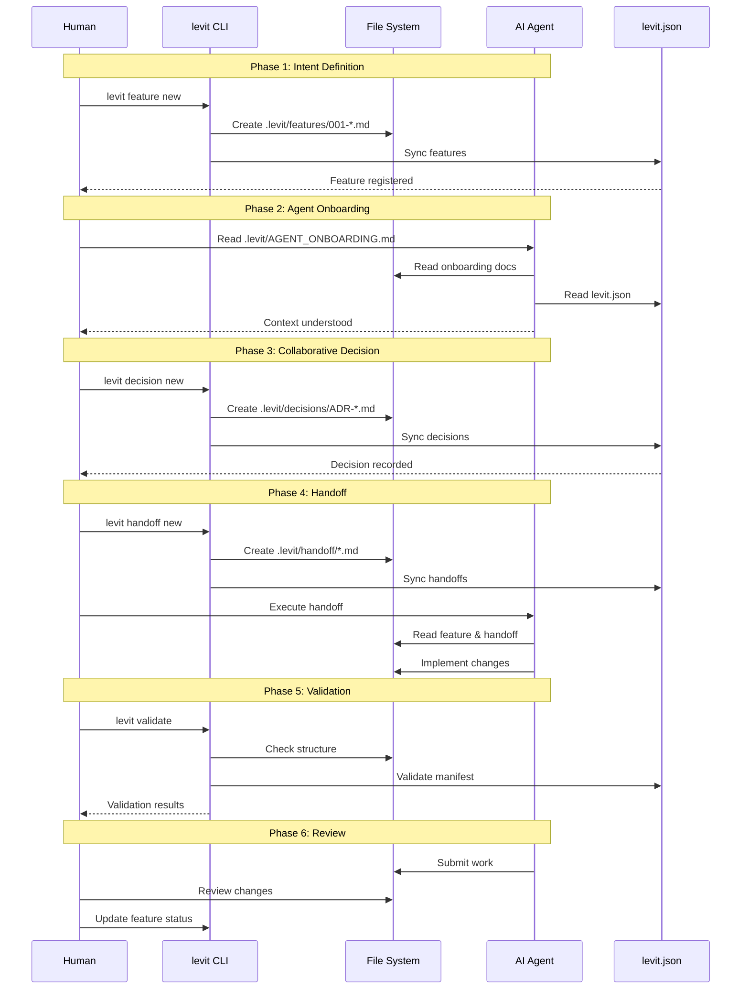
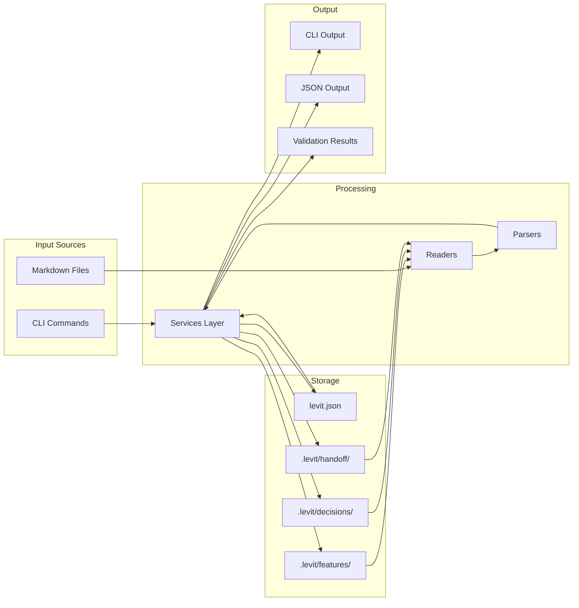
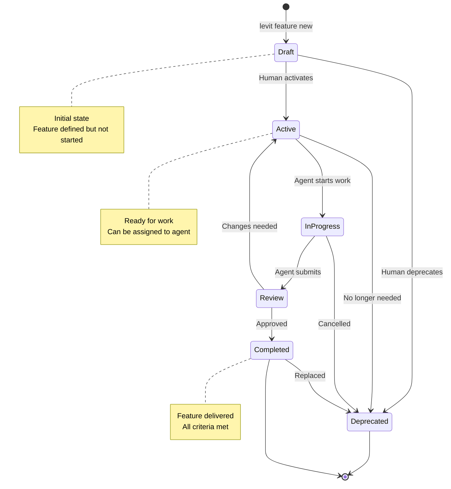
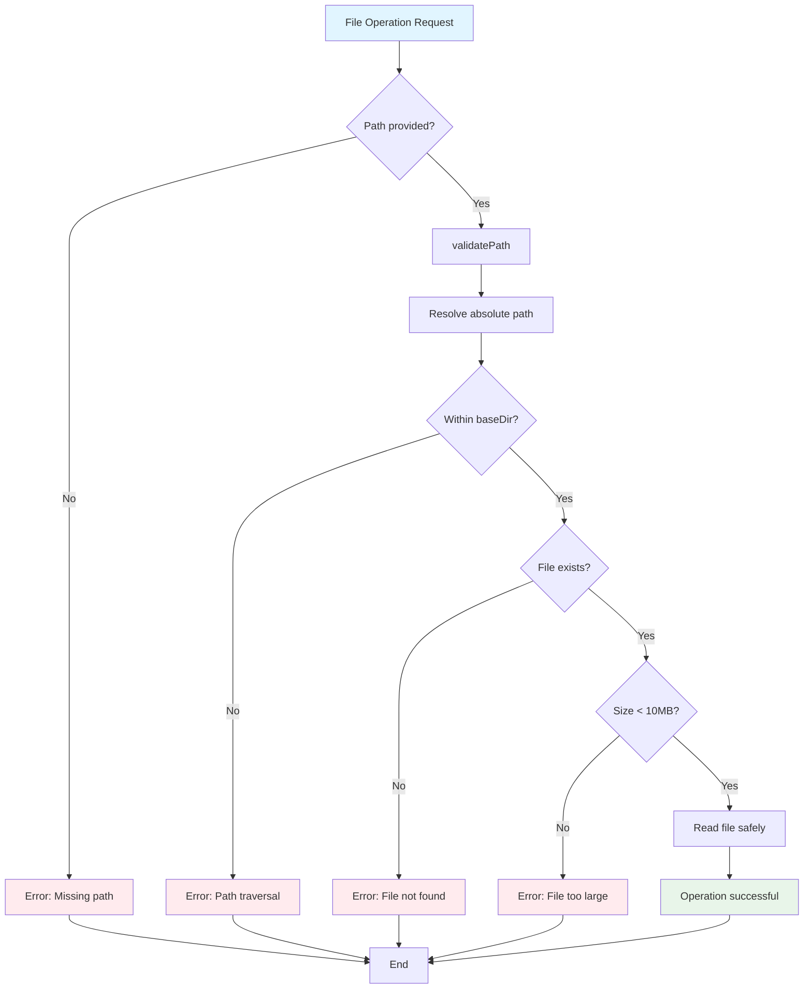
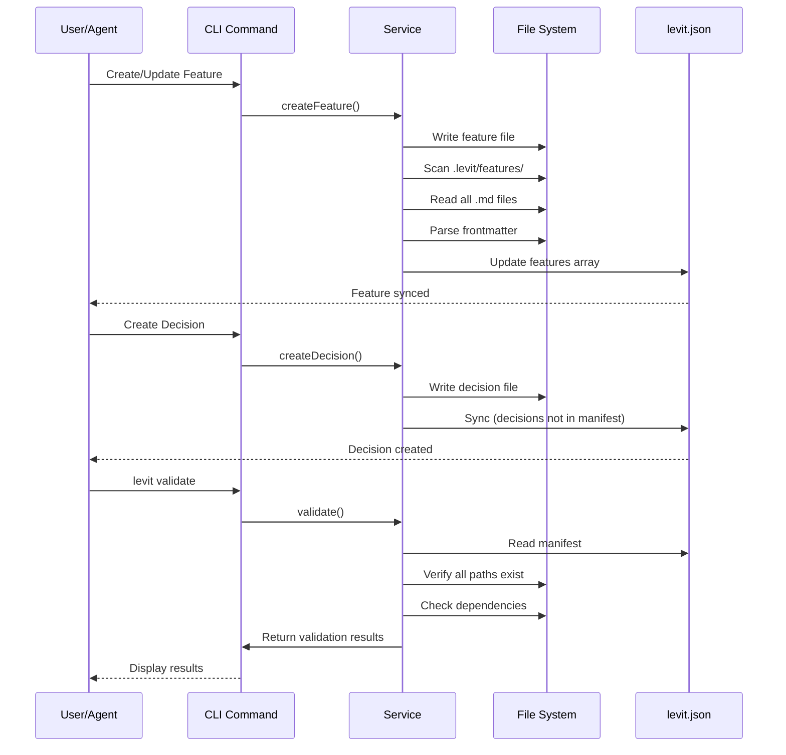
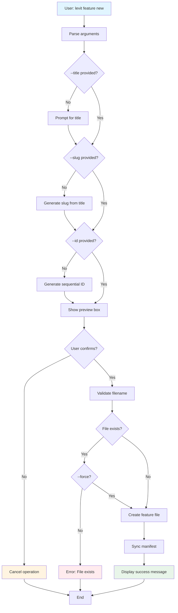
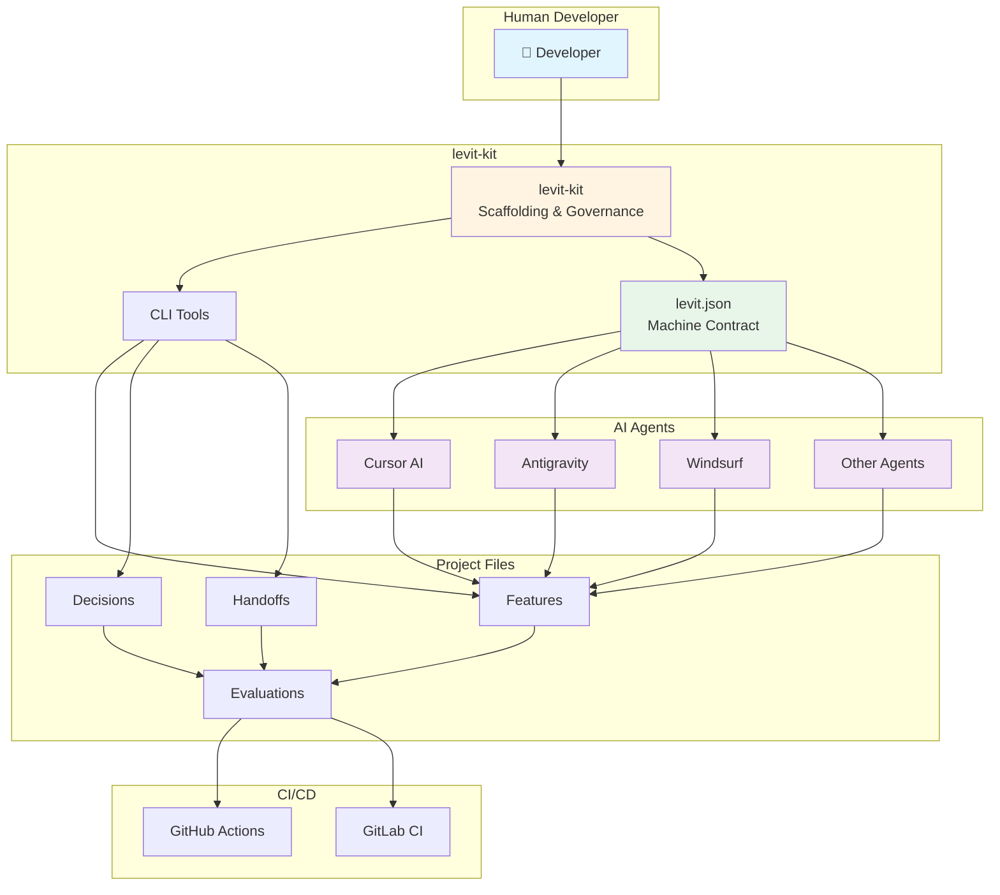

# Diagrammes - levit-kit

Ce document contient des diagrammes visuels pour comprendre l'architecture, les workflows et les concepts de levit-kit.

---

## 📐 Architecture du Projet

### Vue d'ensemble des couches



---

## 🔄 Workflow AIDD (AI-Driven Development)

### Cycle complet Human-Agent



---

## 📁 Structure d'un Projet levit-kit

### Arborescence complète

```mermaid
graph TD
    ROOT[my-project/] --> SC[SOCIAL_CONTRACT.md]
    ROOT --> README[README.md]
    ROOT --> LEVIT[levit.json]
    ROOT --> GIT[.gitignore]
    
    ROOT --> LEVIT_DIR[.levit/]
    
    LEVIT_DIR --> AO[AGENT_ONBOARDING.md]
    LEVIT_DIR --> AC[AGENT_CONTRACT.md]
    
    LEVIT_DIR --> FEATURES[features/]
    FEATURES --> F1[001-feature-1.md]
    FEATURES --> F2[002-feature-2.md]
    FEATURES --> README_F[README.md]
    
    LEVIT_DIR --> DECISIONS[decisions/]
    DECISIONS --> D1[ADR-001-decision-1.md]
    DECISIONS --> D2[ADR-002-decision-2.md]
    DECISIONS --> README_D[README.md]
    
    LEVIT_DIR --> HANDOFF[handoff/]
    HANDOFF --> H1[2026-01-02-feature-1-developer.md]
    HANDOFF --> H2[2026-01-02-feature-2-reviewer.md]
    
    LEVIT_DIR --> ROLES[roles/]
    ROLES --> R1[developer.md]
    ROLES --> R2[reviewer.md]
    
    LEVIT_DIR --> PROMPTS[prompts/]
    PROMPTS --> GR[global-rules.md]
    PROMPTS --> TC[technical-constraints.md]
    
    LEVIT_DIR --> WORKFLOWS[workflows/]
    WORKFLOWS --> SR[submit-for-review.md]
    
    LEVIT_DIR --> EVALS[evals/]
    EVALS --> E1[eval-1.md]
    
    style ROOT fill:#e1f5ff
    style LEVIT_DIR fill:#fff4e1
    style FEATURES fill:#e8f5e9
    style DECISIONS fill:#e8f5e9
    style HANDOFF fill:#e8f5e9
```



---

## 🔀 Flux de Données

### Comment les données circulent dans levit-kit



---

## 🎯 Workflow Feature Lifecycle

### Cycle de vie d'une Feature



---

## 🔐 Sécurité et Validation

### Flux de validation des chemins et fichiers



---

## 📊 Manifest Synchronization

### Comment levit.json est synchronisé



---

## 🎨 Command Flow Example

### Exemple : Création d'une Feature



---

## 🌐 Écosystème levit-kit

### Positionnement dans l'écosystème AIDD



---

## 📝 Notes sur les Diagrammes

### Support Mermaid

- **Mermaid** : Tous les diagrammes utilisent la syntaxe Mermaid, supportée nativement par GitHub, GitLab, et de nombreux éditeurs Markdown.
- **Mise à jour** : Ces diagrammes doivent être mis à jour lorsque l'architecture ou les workflows changent.

### Visualisation selon l'éditeur

#### VS Code
**Extensions recommandées** (déjà configurées dans `.vscode/extensions.json`) :
- `bierner.markdown-mermaid` - Support Mermaid dans la prévisualisation Markdown
- `bpruitt-goddard.mermaid-markdown-syntax-highlighting` - Coloration syntaxique pour Mermaid
- `bierner.markdown-preview-github-styles` - Styles GitHub pour la prévisualisation

**Installation automatique** :
VS Code vous proposera automatiquement d'installer ces extensions si vous ouvrez ce projet.

**Installation manuelle** :
```bash
code --install-extension bierner.markdown-mermaid
code --install-extension bpruitt-goddard.mermaid-markdown-syntax-highlighting
code --install-extension bierner.markdown-preview-github-styles
```

#### GitHub / GitLab
Les diagrammes s'affichent **automatiquement** dans les fichiers `.md` sur GitHub et GitLab.

#### Autres éditeurs
- **Obsidian** : Support natif de Mermaid
- **Typora** : Support natif de Mermaid
- **En ligne** : Utilisez [Mermaid Live Editor](https://mermaid.live/) pour tester et visualiser

### Dépannage

Si les diagrammes ne s'affichent pas dans VS Code :
1. Vérifiez que les extensions sont installées (`Ctrl+Shift+X` puis recherchez "mermaid")
2. Ouvrez la prévisualisation Markdown (`Ctrl+Shift+V` ou `Cmd+Shift+V` sur Mac)
3. Si le problème persiste, redémarrez VS Code

---

*Dernière mise à jour : 2026-01-02*

